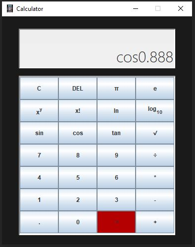

# Calculator
This application is one of my projects I did during my summer vacation. 
The main purpose of this project was to practice and learn.

This is a Java Calculator. 
The application can make calculation with one and two operands, for example: 
addition with two operand, logarithm with one operand, etc. 
The app also contains the pi and e values. 
If there is an incorrect input the app won't show any result and writes "error" to the console.
I may make an information button to show this information in the application.


# How to Run
To run the application on your computer, follow these steps:

1. Ensure you have JDK installed.

2. Have Git - for version control (optional but recommended).

3. Clone the repository or download the source code. You can use the following command if you have Git installed:
    ```
    git clone https://github.com/Toth-Almos/Calculator.git
    ```
4. Open a command prompt or terminal window.

5. Navigate to the src directory of the Java program.
   For example, if the program folder is located at C:\Projects\Calculator\src, you would use the following command in the command prompt:
    ```
    cd C:\Projects\Calculator\src
    ```

6. Once you are inside the src directory, compile the program by executing the following command:
    ```
    javac -d bin src/*.java
    ```

7. After the compilation is successful, you can run the To-Do application using the following command:
    ```
    java -cp bin Main
    ```
   
# Image of the App
